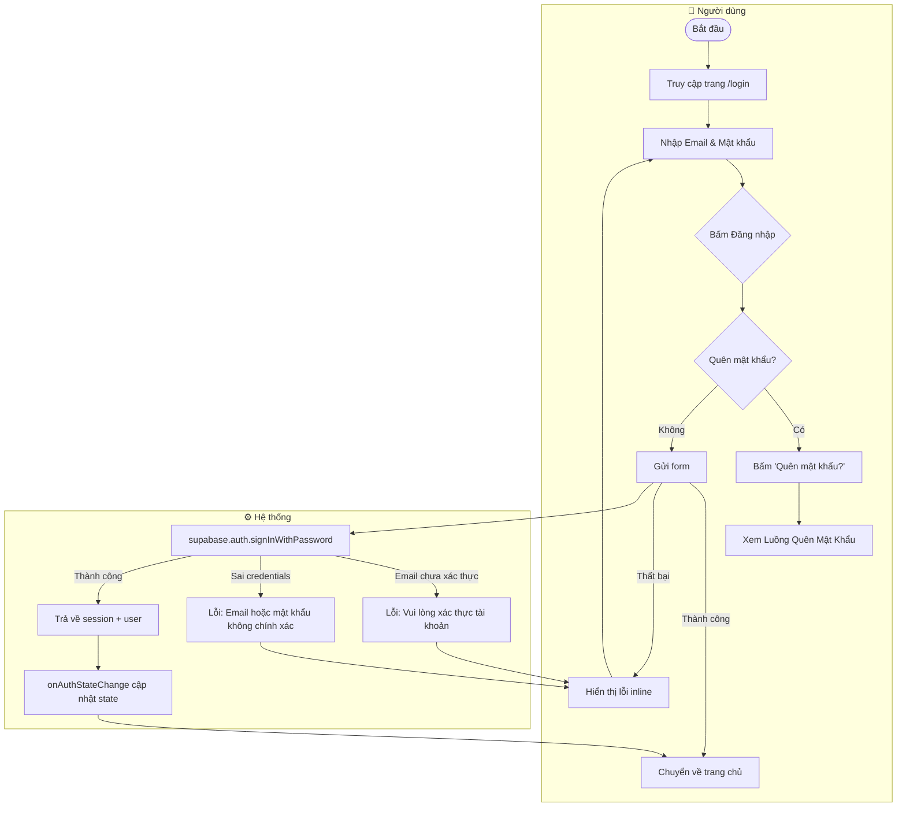
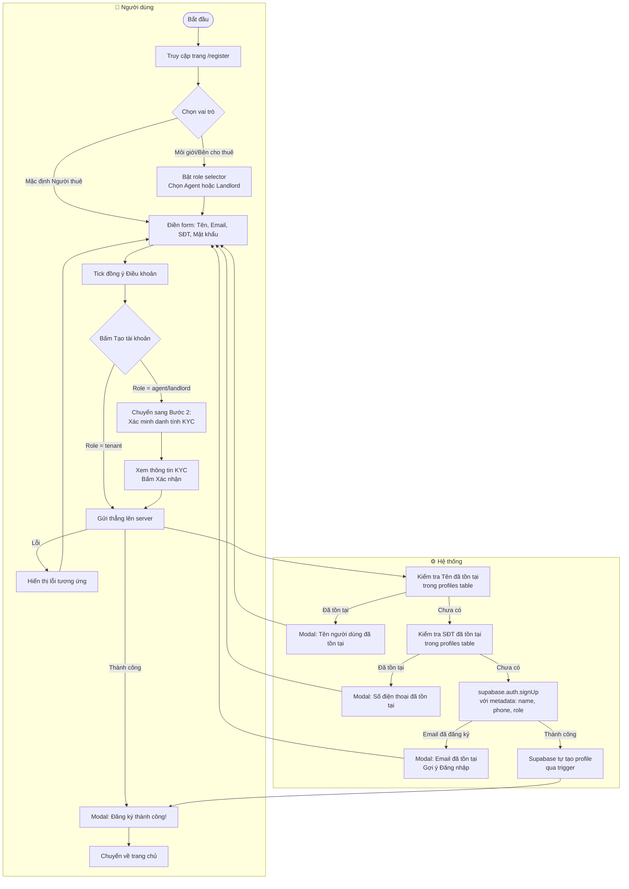
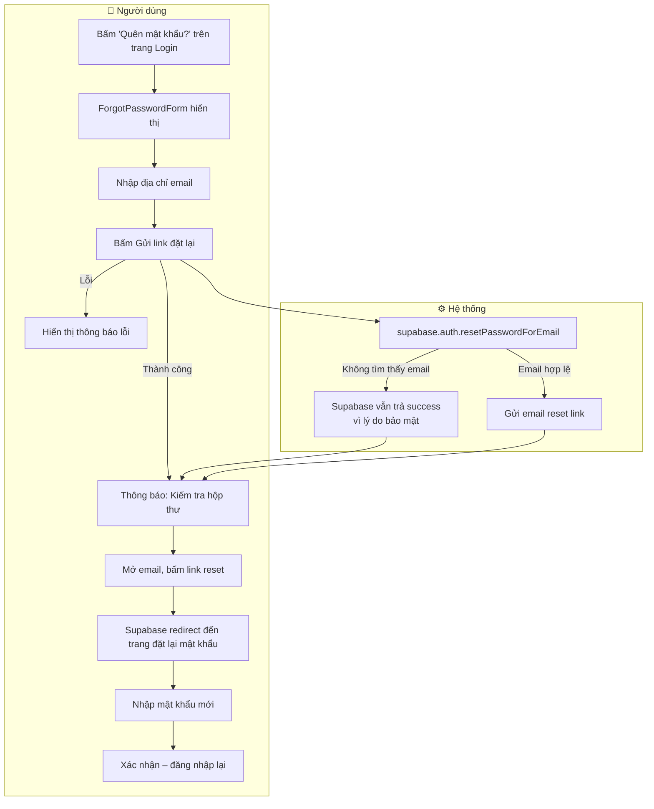
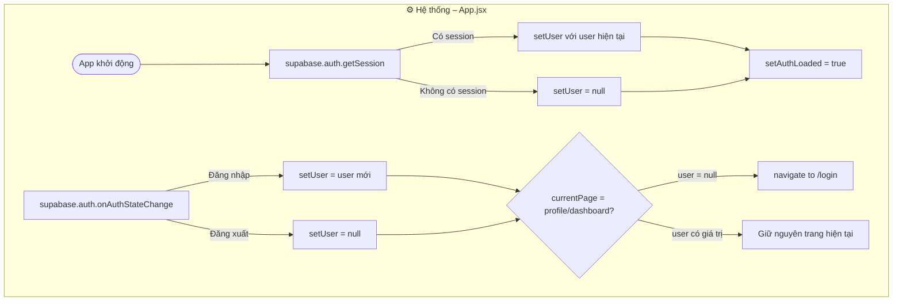

# 🔐 Workflow: Xác thực người dùng (Auth)

Tài liệu mô tả luồng **Đăng ký**, **Đăng nhập** và **Quên mật khẩu** trong hệ thống TroTot.

---

## 1. Luồng Đăng nhập

**Chi tiết xử lý lỗi:**

| Lỗi từ Supabase | Thông báo hiển thị |
|---|---|
| `Invalid login credentials` | Email hoặc mật khẩu không chính xác. |
| `Email not confirmed` | Vui lòng xác thực tài khoản trước khi đăng nhập. |
| Lỗi khác | Hiển thị trực tiếp message từ Supabase |

---

## 2. Luồng Đăng ký

**Validation phía client:**

| Trường | Quy tắc |
|--------|---------|
| Tên người dùng | Tối đa 30 ký tự, chỉ chữ cái (tiếng Việt), số, khoảng trắng |
| Email | Phải chứa `@` |
| Mật khẩu | Tối thiểu 6 ký tự, ≥1 chữ hoa, ≥1 chữ số |
| Xác nhận mật khẩu | Phải trùng với mật khẩu |
| Số điện thoại | 10 số, bắt đầu bằng `0` |
| Điều khoản | Bắt buộc tick |

---

## 3. Luồng Quên mật khẩu

> **Lưu ý bảo mật:** Supabase không phân biệt email tồn tại hay không khi reset password (để tránh email enumeration attack).

---

## 4. Luồng Auth Session (Global)

**Protected routes:** `/profile` và `/dashboard` — chuyển hướng về `/login` nếu chưa đăng nhập.
