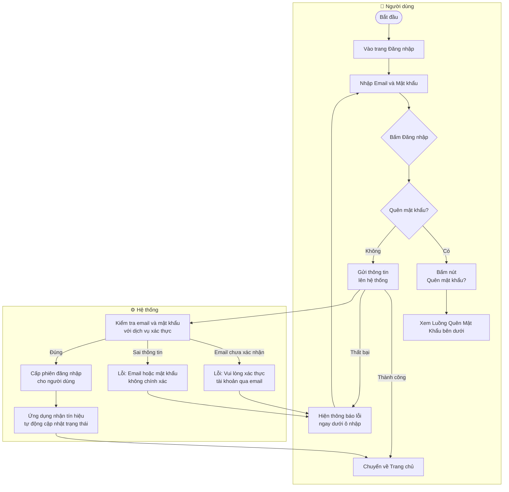
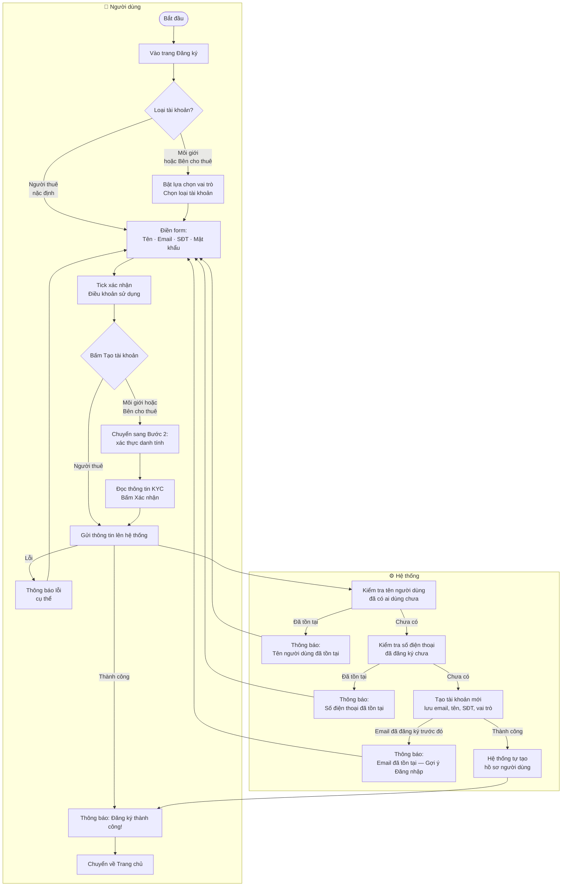
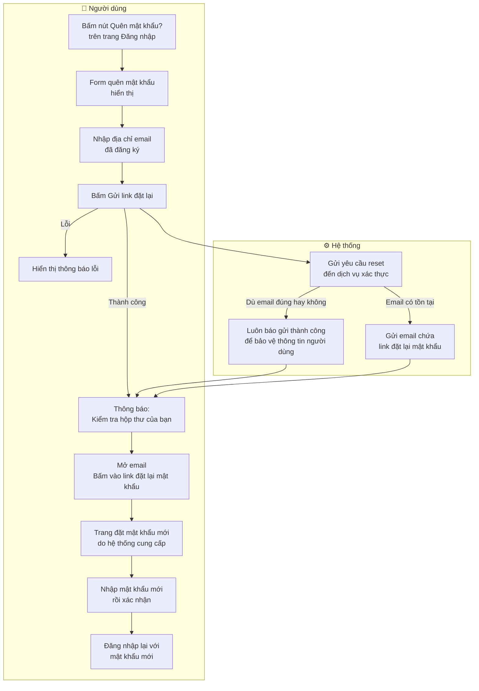
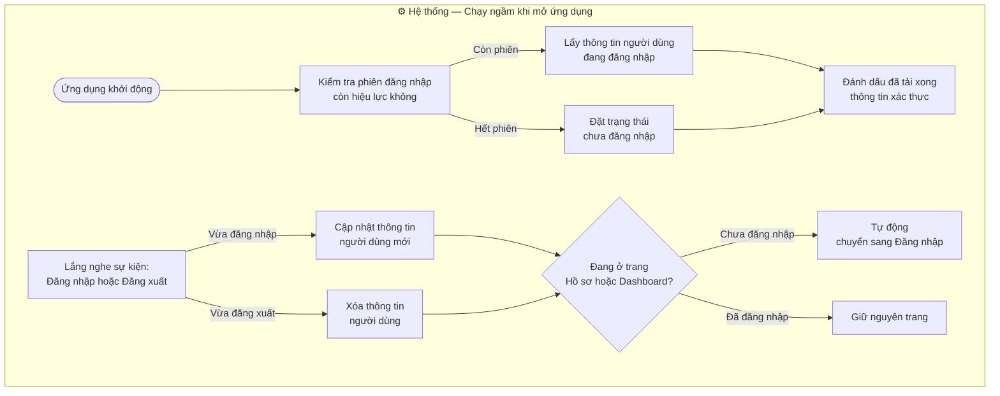

# 🔐 Đăng ký · Đăng nhập · Quên mật khẩu

Tài liệu mô tả cách người dùng tạo tài khoản, đăng nhập và lấy lại mật khẩu trong TroTot.

---

## 1. Đăng nhập

**Các thông báo lỗi:**

| Tình huống              | Thông báo hiển thị                               |
| ----------------------- | ------------------------------------------------ |
| Sai email hoặc mật khẩu | Email hoặc mật khẩu không chính xác.             |
| Chưa xác nhận email     | Vui lòng xác thực tài khoản trước khi đăng nhập. |
| Lỗi khác                | Hiển thị mô tả lỗi cụ thể                        |

---

## 2. Đăng ký tài khoản

**Quy tắc nhập thông tin:**

| Trường            | Yêu cầu                                                                   |
| ----------------- | ------------------------------------------------------------------------- |
| Tên người dùng    | Tối đa 30 ký tự, chỉ dùng chữ cái (có dấu tiếng Việt), số và khoảng trắng |
| Email             | Phải có dấu `@` và đúng định dạng email                                   |
| Mật khẩu          | Tối thiểu 6 ký tự, có ít nhất 1 chữ hoa và 1 chữ số                       |
| Xác nhận mật khẩu | Phải giống hệt mật khẩu vừa nhập                                          |
| Số điện thoại     | 10 số, bắt đầu bằng số `0`                                                |
| Điều khoản        | Bắt buộc phải tick vào ô đồng ý                                           |

---

## 3. Quên mật khẩu

> **Lưu ý bảo mật:** Hệ thống luôn hiển thị thông báo "Kiểm tra hộp thư" dù email có tồn tại hay không — để tránh kẻ xấu đoán được email nào đã đăng ký.

---

## 4. Phiên đăng nhập hoạt động toàn ứng dụng

**Các trang yêu cầu đăng nhập:** Hồ sơ cá nhân (`/profile`) và Quản lý tin đăng (`/dashboard`) — nếu chưa đăng nhập sẽ tự động chuyển về trang Đăng nhập.
