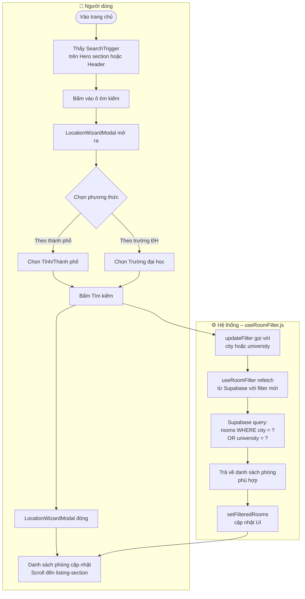
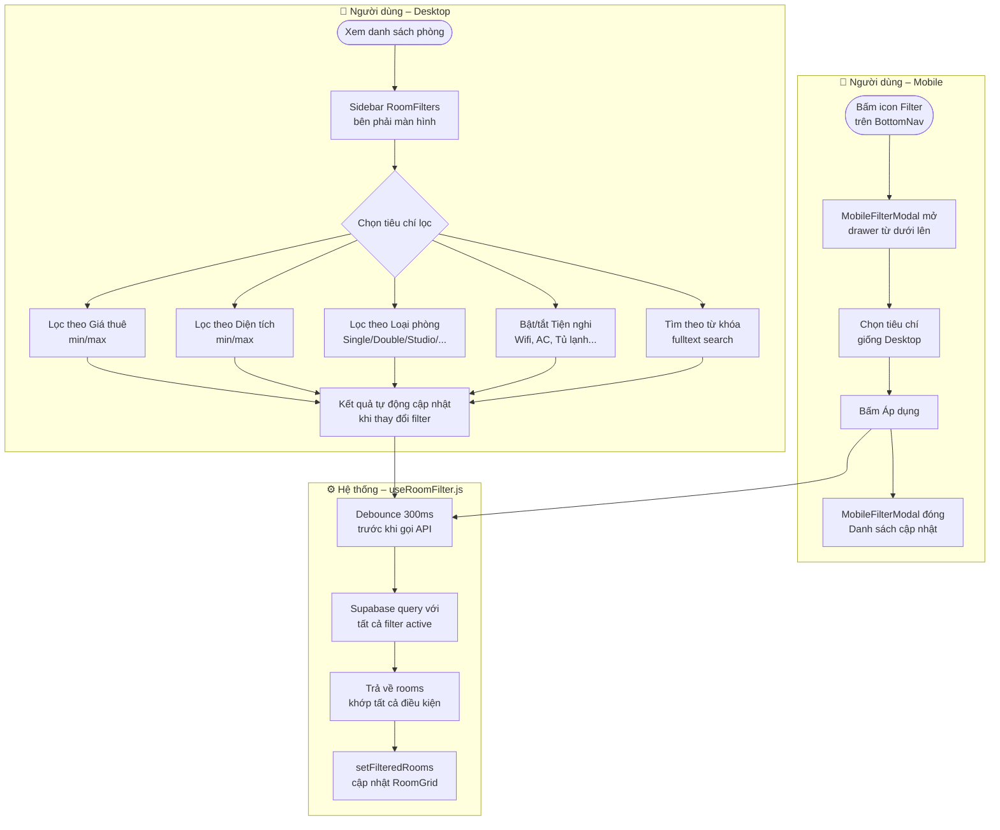
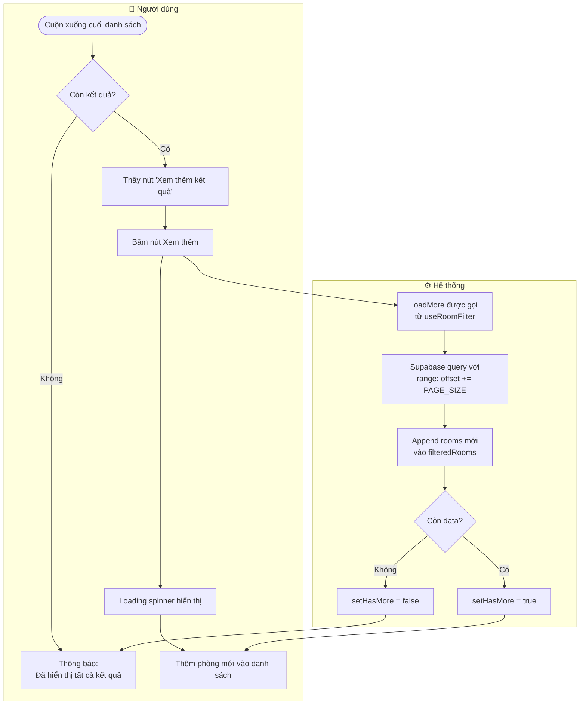
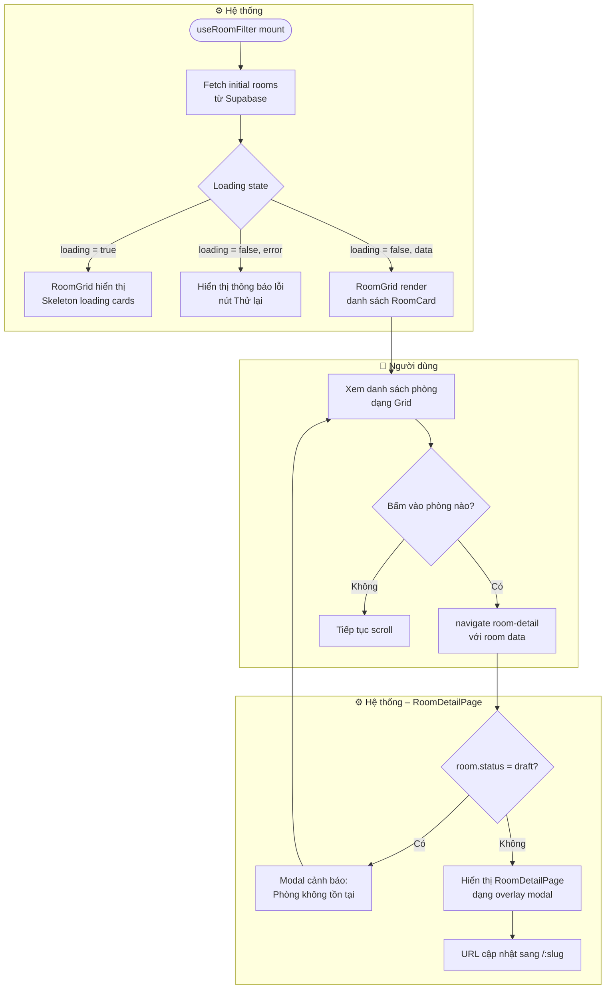

# 🔍 Workflow: Tìm kiếm & Lọc phòng (Home + Search)

Tài liệu mô tả luồng **tìm kiếm theo vị trí**, **lọc phòng theo tiêu chí** và **phân trang** trên trang chủ.

---

## 1. Luồng Tìm kiếm theo vị trí



---

## 2. Luồng Lọc phòng nâng cao



**Danh sách filter hỗ trợ:**

| Filter | Kiểu | Mô tả |
|--------|------|--------|
| `city` | string | Tỉnh/Thành phố |
| `university` | string | Trường đại học gần đó |
| `search` | string | Tìm theo từ khóa (title, address) |
| `minPrice` / `maxPrice` | number | Khoảng giá (VNĐ/tháng) |
| `minArea` / `maxArea` | number | Khoảng diện tích (m²) |
| `roomType` | string | Loại phòng |
| `amenities` | string[] | Danh sách tiện nghi (toggle) |

---

## 3. Luồng Load thêm kết quả (Pagination)



---

## 4. Luồng Hiển thị danh sách phòng



---

## 5. Cấu trúc component trang chủ

```
App.jsx
└── HomePage.jsx
    ├── Hero Section
    │   ├── SearchTrigger         ← Mở LocationWizardModal
    │   └── Stats bar (300+ phòng, N thành phố, ...)
    │
    └── Listing Section (#listing-section)
        ├── RoomFilters (Desktop sidebar)   ← useRoomFilter filters
        └── RoomGrid
            └── RoomCard × N               ← Click → navigate('room-detail')

App.jsx (global)
└── LocationWizardModal           ← isLocationModalOpen state
└── MobileFilterModal             ← showMobileFilter state
```
