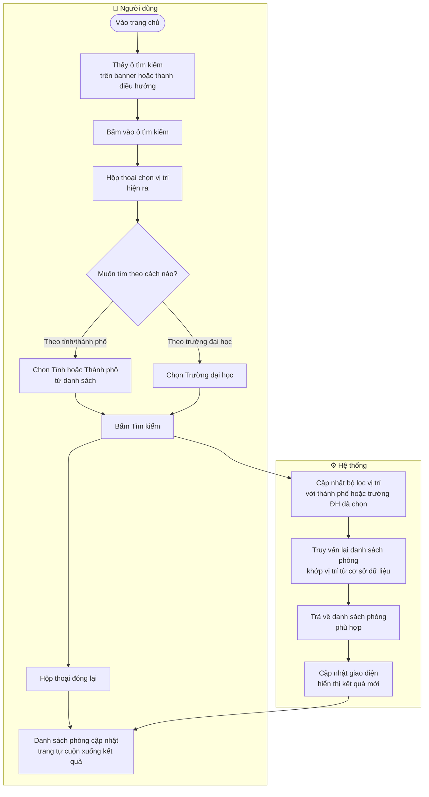
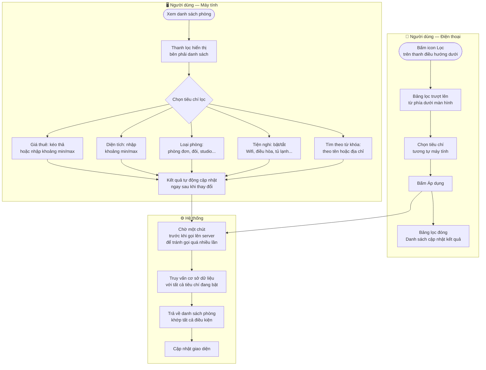
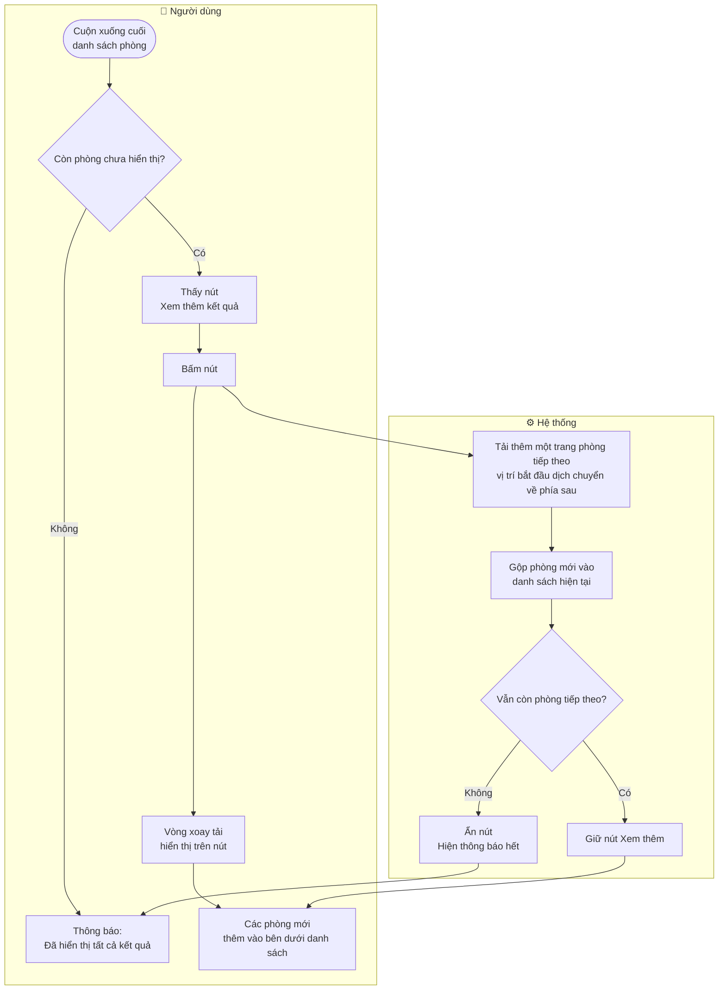
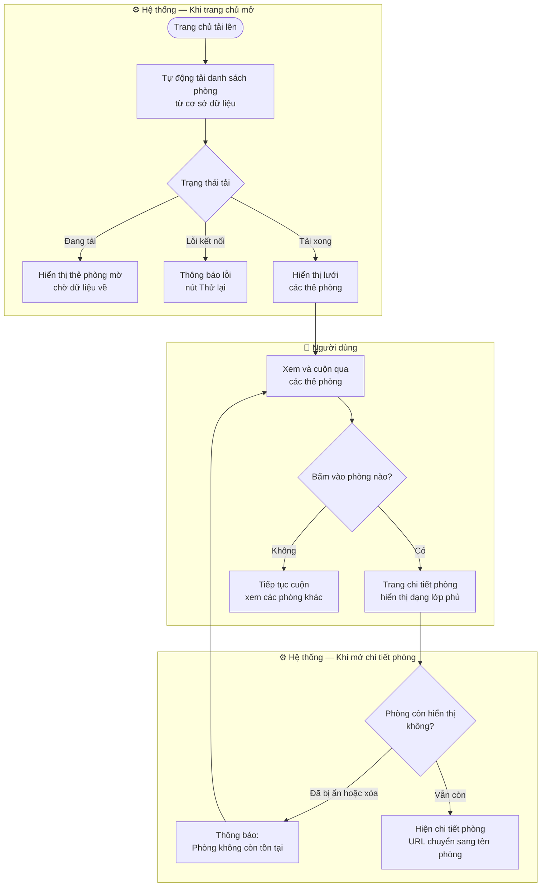

# 🔍 Tìm kiếm & Lọc phòng — Trang chủ

Tài liệu mô tả cách người dùng tìm kiếm phòng theo vị trí, lọc theo tiêu chí và xem thêm kết quả trên trang chủ TroTot.

---

## 1. Tìm kiếm theo vị trí



---

## 2. Lọc phòng nâng cao



**Các tiêu chí lọc hỗ trợ:**

| Tiêu chí | Loại | Mô tả |
|----------|------|--------|
| Tỉnh/Thành phố | Chọn một | Lọc theo vị trí địa lý |
| Trường đại học | Chọn một | Lọc phòng gần trường |
| Từ khóa | Nhập text | Tìm theo tên phòng hoặc địa chỉ |
| Giá thuê | Khoảng số | Giá tháng tối thiểu và tối đa |
| Diện tích | Khoảng số | Diện tích tối thiểu và tối đa |
| Loại phòng | Chọn một | Phòng đơn, đôi, studio, căn hộ mini... |
| Tiện nghi | Bật/tắt nhiều | Wifi, điều hòa, tủ lạnh, máy giặt... |

---

## 3. Xem thêm kết quả



---

## 4. Danh sách phòng hiển thị như thế nào



---

## 5. Sơ đồ các thành phần trang chủ

```
Trang chủ (HomePage)
│
├── Banner Hero
│   ├── Ô tìm kiếm (SearchTrigger)     ← Bấm để mở hộp chọn vị trí
│   └── Số liệu thống kê (300+ phòng, N thành phố...)
│
└── Khu vực danh sách phòng
    ├── Thanh lọc bên phải (máy tính)  ← Bộ lọc nâng cao
    └── Lưới phòng                     ← Các thẻ phòng, bấm để xem chi tiết

Toàn ứng dụng (App)
├── Hộp thoại chọn vị trí             ← Hiện khi bấm ô tìm kiếm
└── Bảng lọc điện thoại               ← Trượt lên từ dưới khi bấm icon lọc
```
