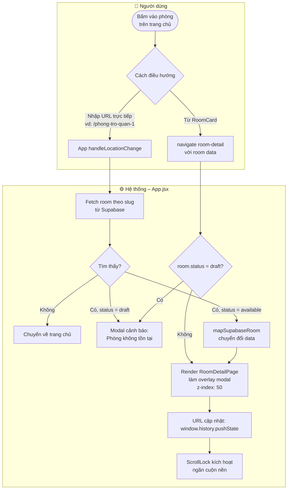
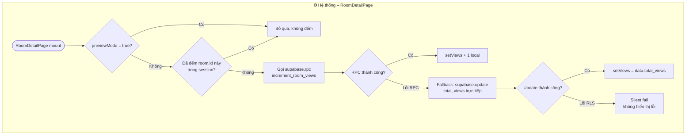
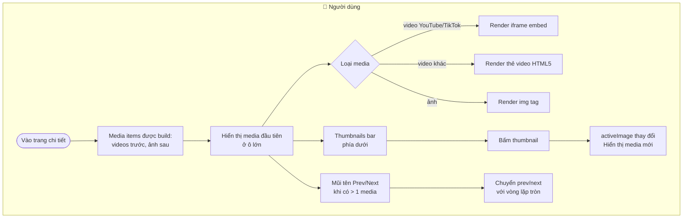
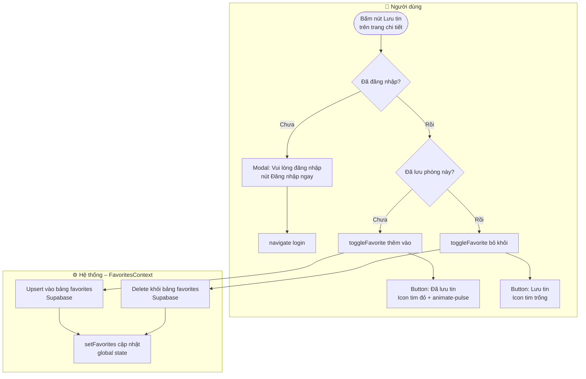
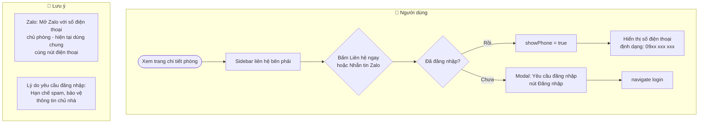
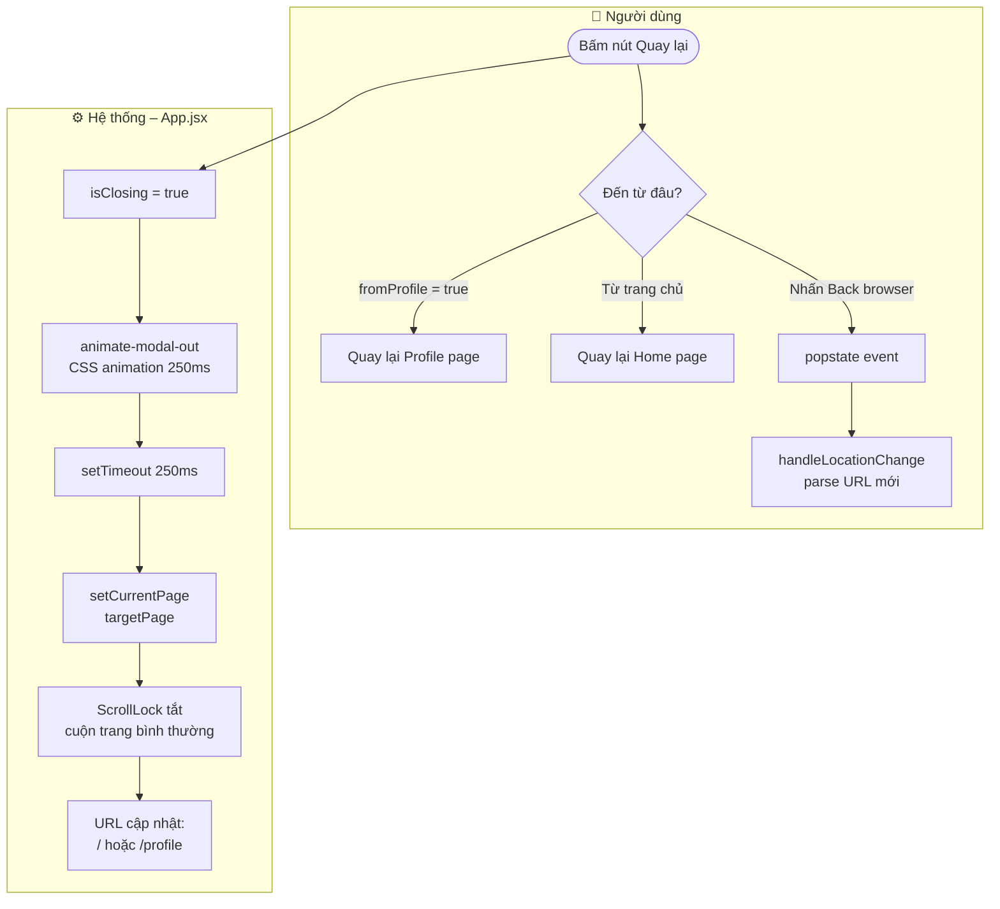

# 🏡 Workflow: Xem chi tiết phòng

Tài liệu mô tả luồng **xem thông tin phòng**, **yêu thích**, **liên hệ chủ nhà**, **bình luận** và **đếm lượt xem**.

---

## 1. Luồng mở trang chi tiết phòng



---

## 2. Luồng đếm lượt xem



> **Lưu ý:** `lastIncrementedRoomId` ref ngăn double-count khi component re-render.

---

## 3. Luồng Gallery ảnh / video



---

## 4. Luồng Yêu thích (Save/Unsave)



---

## 5. Luồng Liên hệ chủ nhà



---

## 6. Luồng Bình luận

```mermaid
flowchart TD
    subgraph USER["👤 Người dùng"]
        A([Cuộn xuống phần bình luận]) --> B[CommentSection hiển thị]
        B --> C[Xem danh sách bình luận\ncủa phòng]
        C --> D{Muốn bình luận?}
        D -- Chưa đăng nhập --> E[Hiển thị nút\nĐăng nhập để bình luận]
        E --> F[navigate login]
        D -- Đã đăng nhập --> G[Ô nhập bình luận\nhiển thị]
        G --> H[Nhập nội dung]
        H --> I[Bấm Gửi]
        I --> J{Bình luận của mình?}
        J -- Có --> K[Nút Xóa hiển thị\nbên cạnh comment]
        K --> L[Bấm Xóa\nXác nhận → Xóa]
    end

    subgraph SYSTEM["⚙️ Hệ thống – CommentSection.jsx"]
        I --> M[Insert vào bảng comments\n{room_id, user_id, content}]
        M --> N[Refetch comments\ntheo room_id]
        N --> O[Re-render danh sách\nbình luận mới nhất]
        L --> P[Delete comment\ntheo id]
        P --> N
    end
```

---

## 7. Luồng đóng modal Room Detail



---

## 8. Thông tin hiển thị trên trang chi tiết

| Section | Nội dung |
|---------|---------|
| **Gallery** | Ảnh + Video (YouTube/TikTok embed) |
| **Thông tin chính** | Tiêu đề, địa chỉ đầy đủ, lượt xem, ngày cập nhật |
| **Gần trường ĐH** | Badge các trường ĐH cùng quận/phường |
| **Thống kê** | Giá thuê, diện tích, tối đa người, loại vệ sinh |
| **Mô tả** | Mô tả chi tiết từ chủ phòng |
| **Chi phí** | Cọc, điện, nước, internet, gửi xe, dịch vụ thêm |
| **Nội quy** | Giờ giấc, thú cưng, giặt đồ, chung chủ |
| **Tiện nghi** | Grid các tiện nghi (sáng/tối theo có/không) |
| **Bản đồ** | Placeholder (đang phát triển) |
| **Bình luận** | CommentSection với phân trang |
| **Sidebar liên hệ** | Giá, mã tin, thông tin người đăng, nút Gọi/Zalo |
