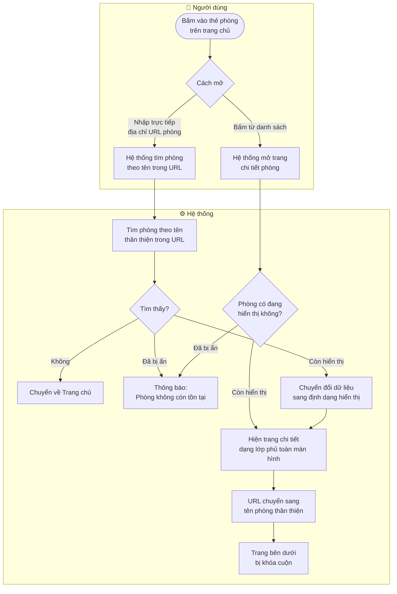
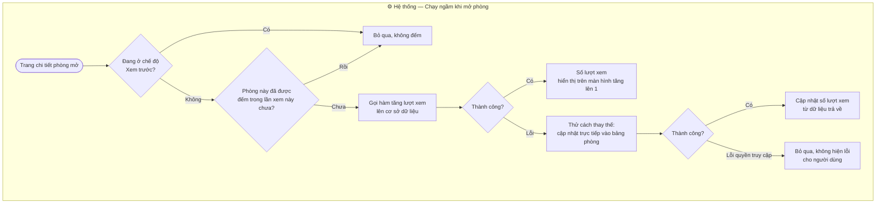
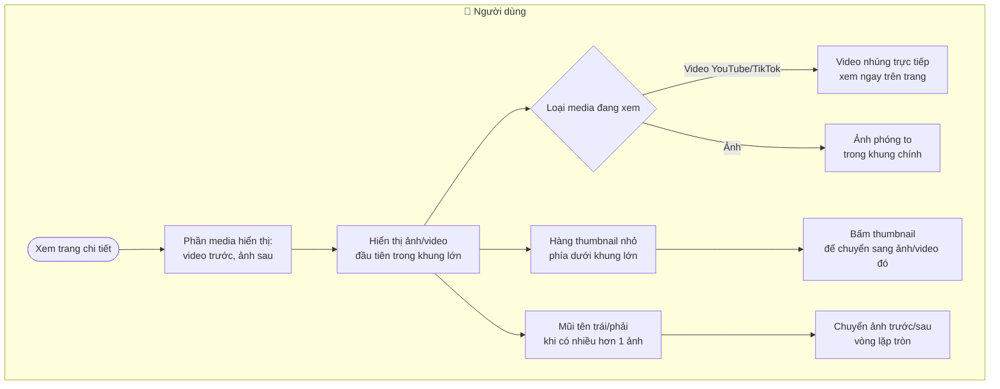
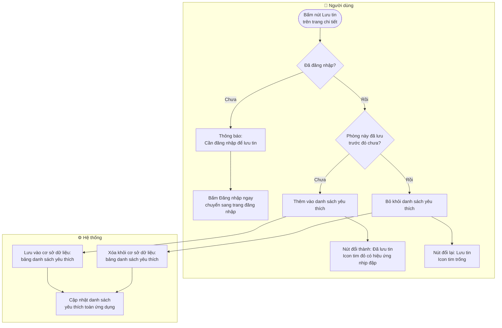
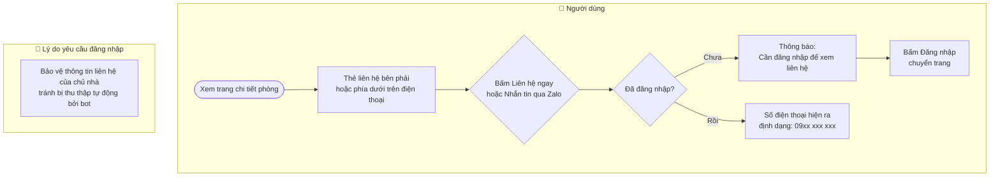
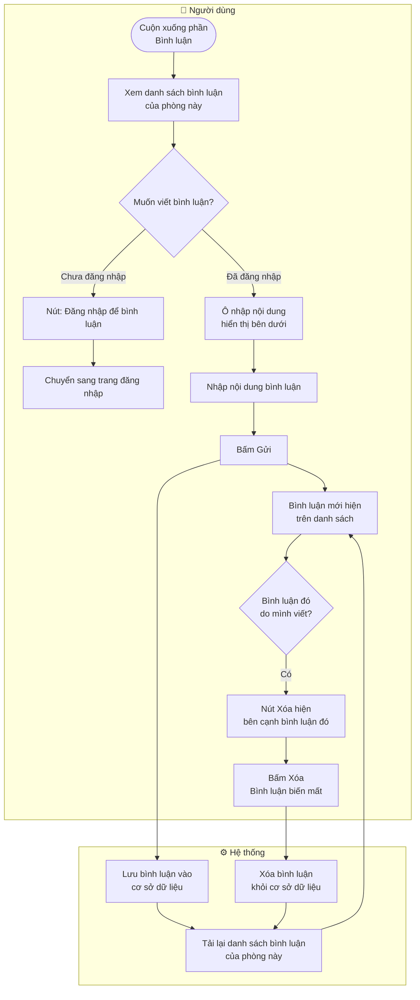
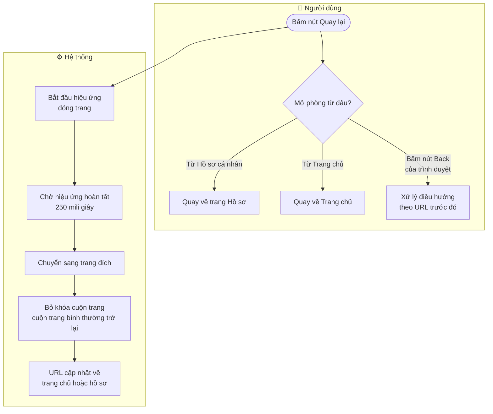

# 🏡 Xem chi tiết phòng — Yêu thích · Liên hệ · Bình luận

Tài liệu mô tả mọi thứ xảy ra khi người dùng mở một tin đăng phòng trọ cụ thể.

---

## 1. Mở trang chi tiết phòng

---

## 2. Đếm lượt xem phòng

> **Lưu ý:** Mỗi lần xem chỉ được đếm một lần — dù người dùng quay lại xem nhiều lần trong cùng một phiên.

---

## 3. Gallery ảnh và video

---

## 4. Lưu phòng yêu thích

---

## 5. Liên hệ chủ nhà

---

## 6. Bình luận

---

## 7. Đóng trang chi tiết phòng — Quay lại

---

## 8. Tóm tắt thông tin trên trang chi tiết phòng

| Khu vực | Nội dung hiển thị |
|---------|------------------|
| **Gallery** | Ảnh và video (YouTube/TikTok nhúng trực tiếp) |
| **Tiêu đề** | Tên phòng, địa chỉ đầy đủ, số lượt xem, ngày cập nhật, ngày hết hạn |
| **Gần trường** | Nhãn các trường đại học thuộc cùng quận/phường |
| **Thống kê nhanh** | Giá thuê, diện tích, sức chứa tối đa, loại phòng vệ sinh |
| **Mô tả** | Nội dung mô tả do người đăng viết |
| **Chi phí** | Tiền cọc, điện, nước, internet, gửi xe, dịch vụ thêm |
| **Nội quy** | Giờ giấc ra vào, thú cưng, giặt đồ, chung chủ hay không |
| **Tiện nghi** | Lưới các tiện nghi — sáng nếu có, mờ nếu không có |
| **Bản đồ** | Đang phát triển |
| **Bình luận** | Danh sách bình luận của người thuê |
| **Thẻ liên hệ** | Giá, mã tin, thông tin chủ phòng, nút Gọi điện và Zalo |
