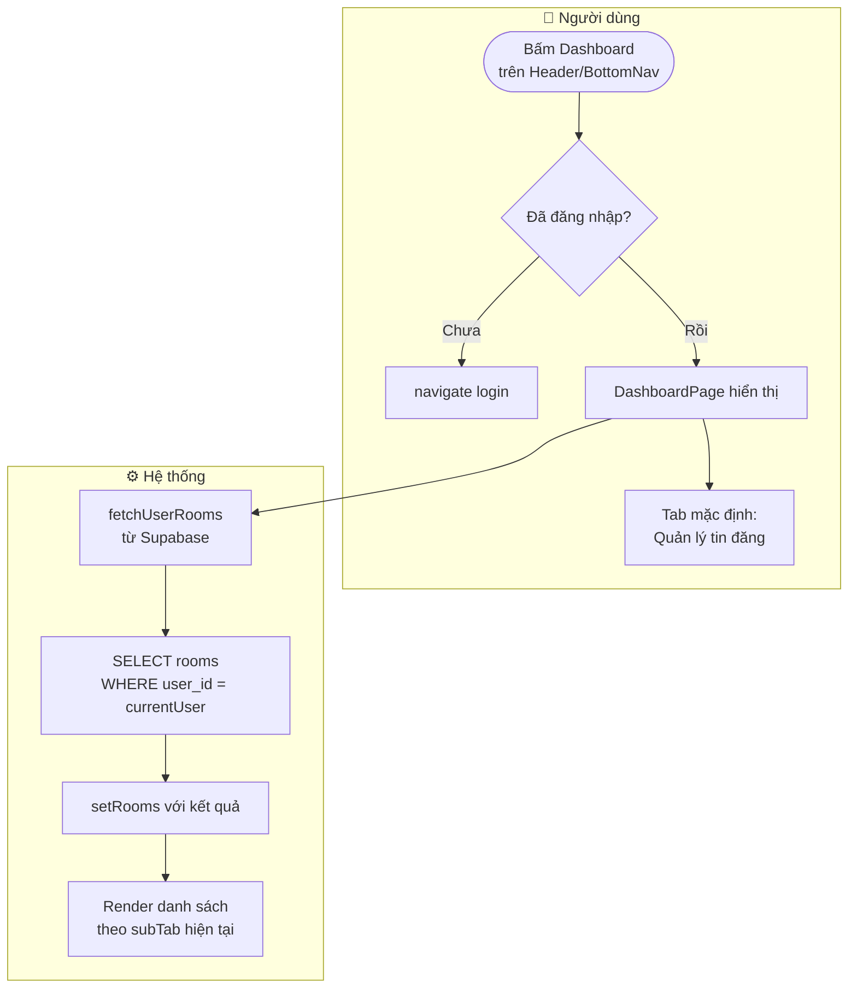
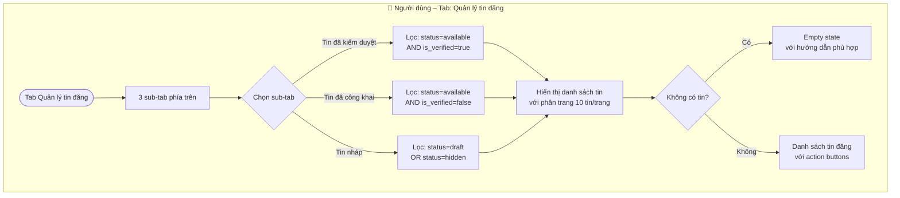
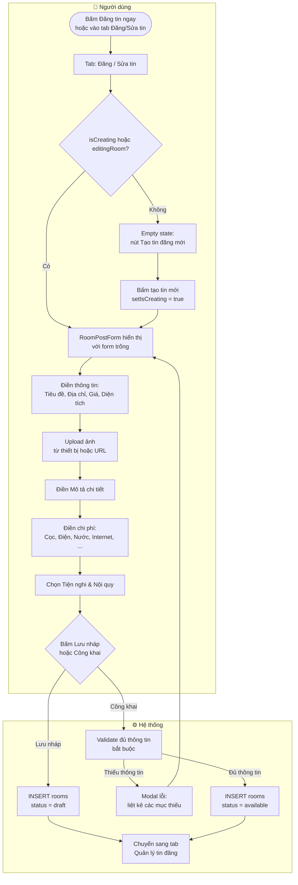
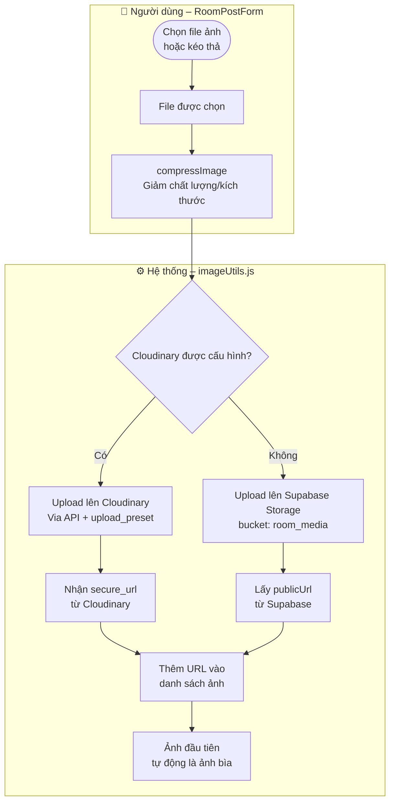
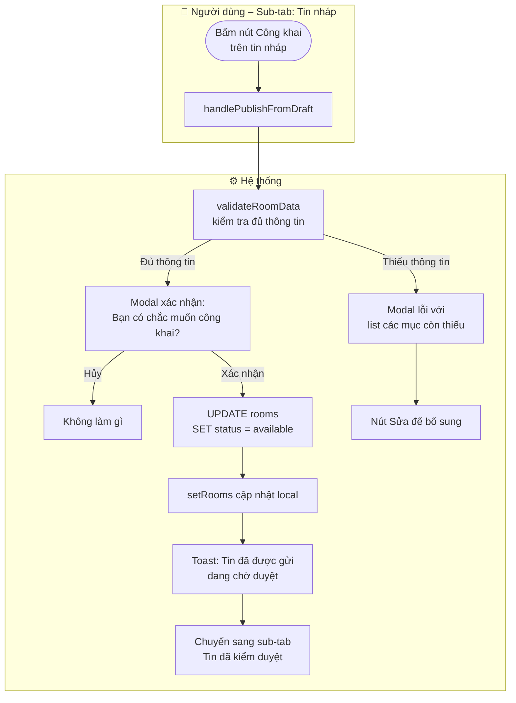
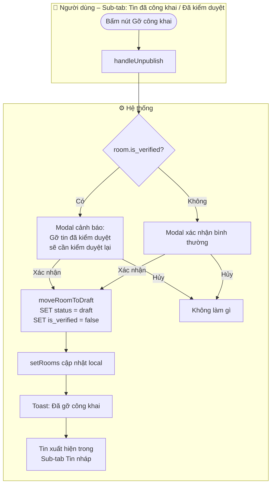
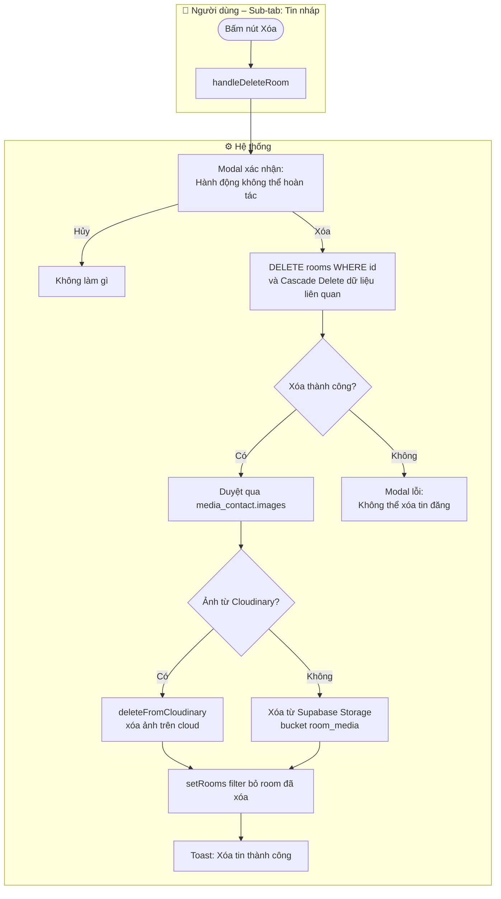
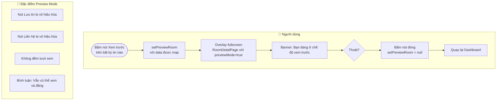
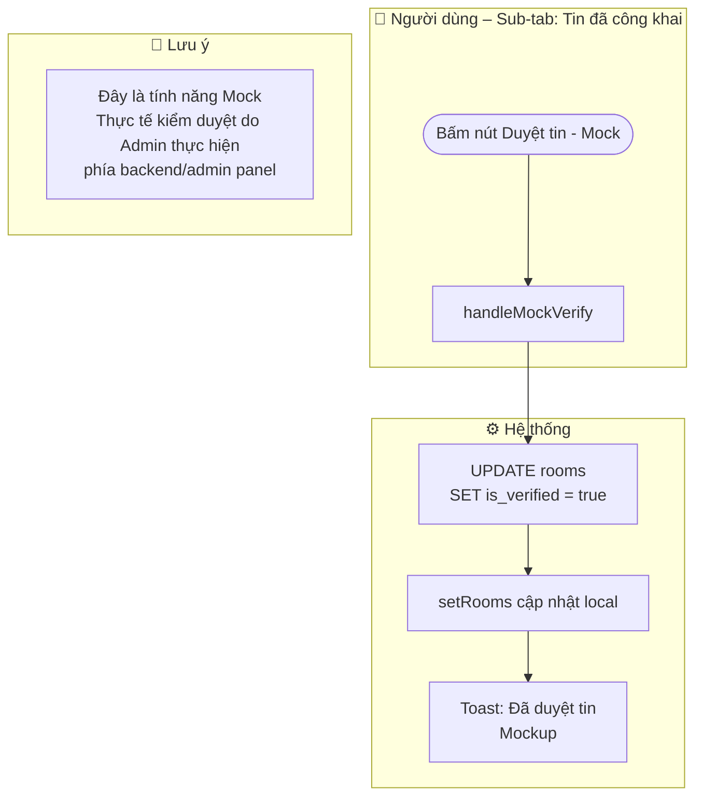

# 📊 Workflow: Dashboard – Quản lý tin đăng

Tài liệu mô tả luồng **đăng tin mới**, **sửa tin**, **công khai/gỡ**, **xóa tin** và **xem trước** dành cho vai trò **Môi giới** và **Bên cho thuê**.

> **Yêu cầu:** Phải đăng nhập và có role `agent` hoặc `landlord`.

---

## 1. Luồng truy cập Dashboard

---

## 2. Luồng xem và lọc tin đăng theo trạng thái

**Badge trạng thái:**

| `status` | `is_verified` | Hiển thị |
|----------|--------------|---------|
| `available` | `true` | 🟢 Đã công khai · 🔵 Đã kiểm duyệt |
| `available` | `false` | 🟢 Đã công khai (chờ kiểm duyệt) |
| `draft` | - | ⬜ Bản nháp |
| `hidden` | - | 🟡 Đã ẩn |
| `expired` | - | 🔴 Hết hạn |

---

## 3. Luồng Đăng tin mới

**Validation khi công khai tin:**

| Trường | Yêu cầu |
|--------|---------|
| Tiêu đề | Bắt buộc, không được trống |
| Giá thuê | ≥ 100.000đ |
| Diện tích | > 0 m² |
| Địa chỉ | Đủ: Tỉnh + Huyện + Xã + Số nhà |
| Tiền cọc | ≥ 500.000đ |
| Ảnh thực tế | ≥ 1 ảnh |
| Mô tả | ≥ 20 ký tự |
| Link video | Nếu có, phải là YouTube hoặc TikTok hợp lệ |

---

## 4. Luồng Upload ảnh phòng

---

## 5. Luồng Công khai tin từ bản nháp

---

## 6. Luồng Gỡ công khai tin

---

## 7. Luồng Xóa tin đăng

---

## 8. Luồng Xem trước tin đăng

---

## 9. Luồng Kiểm duyệt tin (Mock)

