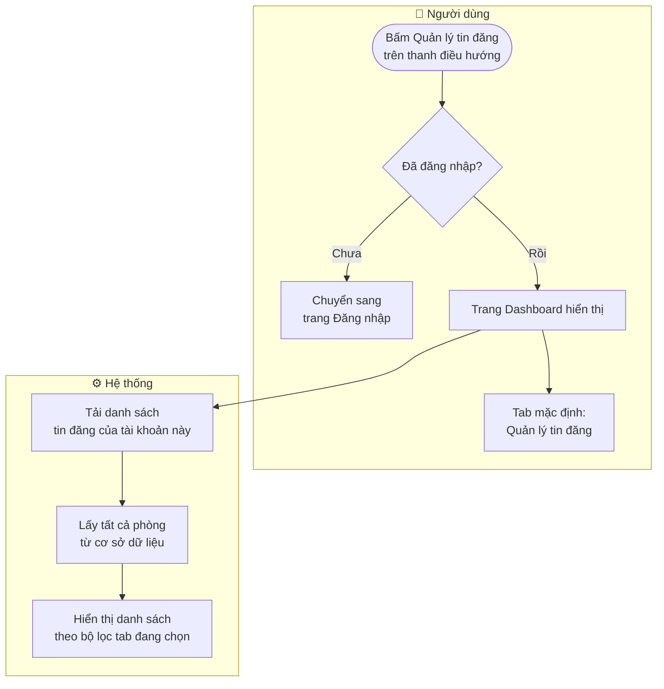
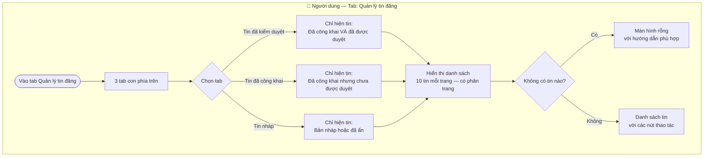
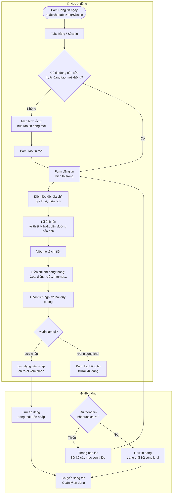
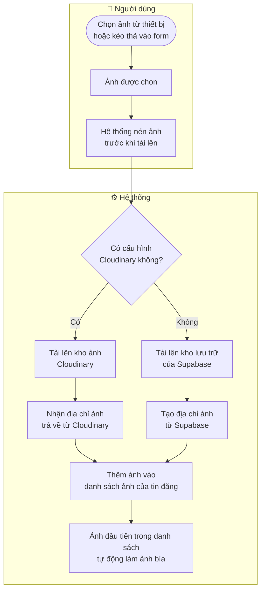
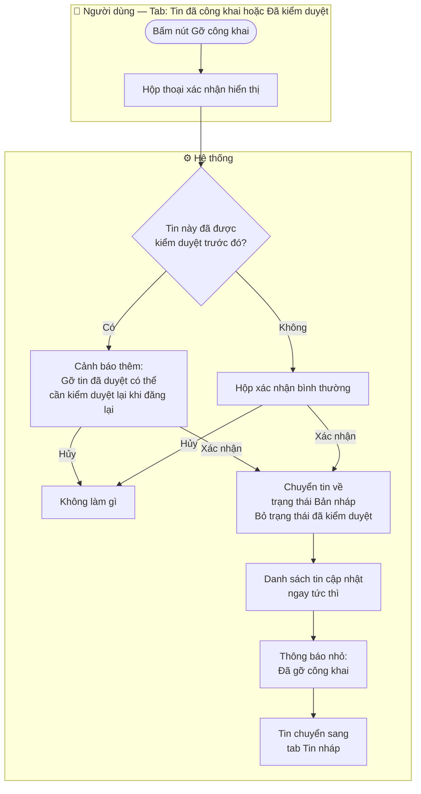
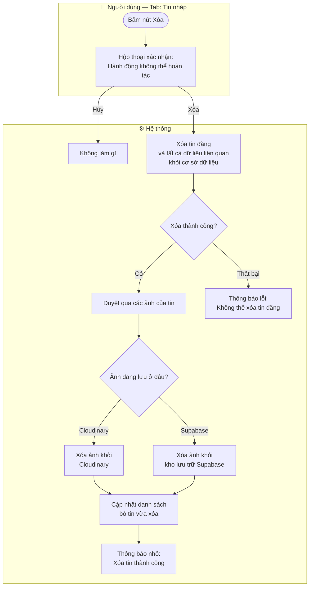
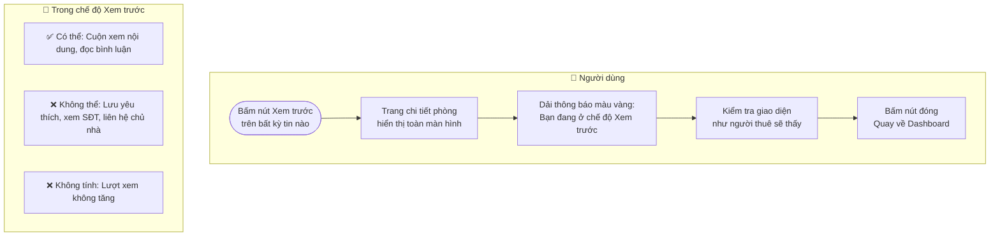
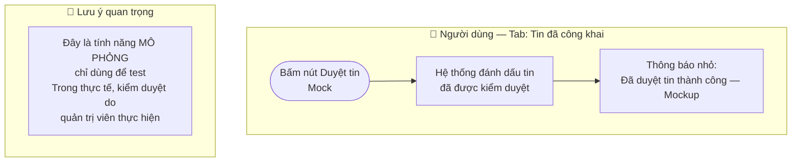

# 📊 Quản lý tin đăng — Dành cho chủ nhà và môi giới

Tài liệu mô tả cách đăng tin mới, sửa tin, công khai, gỡ, xóa và xem trước tin đăng phòng trọ trên Dashboard của TroTot.

> **Yêu cầu:** Phải đăng nhập với tài khoản **Môi giới** hoặc **Bên cho thuê**.

---

## 1. Vào trang Quản lý tin đăng

---

## 2. Xem tin theo trạng thái

**Ý nghĩa các trạng thái:**

| Trạng thái | Màu nhãn | Ý nghĩa |
|------------|---------|---------|
| Đã công khai + Đã kiểm duyệt | 🟢 Xanh · 🔵 Xanh dương | Tin đang hiển thị, đã được admin duyệt |
| Đã công khai + Chờ duyệt | 🟢 Xanh | Tin đang hiển thị, chờ admin kiểm tra |
| Bản nháp | ⬜ Xám | Mới tạo, chưa ai xem được |
| Đã ẩn | 🟡 Vàng | Tạm thời không hiển thị |
| Hết hạn | 🔴 Đỏ | Tin đã quá ngày hết hạn |

---

## 3. Đăng tin phòng mới

**Thông tin bắt buộc khi đăng công khai:**

| Thông tin | Điều kiện |
|-----------|-----------|
| Tiêu đề tin | Không được để trống |
| Giá thuê | Tối thiểu 100.000đ/tháng |
| Diện tích | Phải lớn hơn 0 m² |
| Địa chỉ | Phải có đủ: Tỉnh · Huyện · Xã · Số nhà |
| Tiền cọc | Tối thiểu 500.000đ |
| Ảnh thực tế | Ít nhất 1 ảnh phòng |
| Mô tả | Tối thiểu 20 ký tự |
| Link video | Nếu có, phải là link YouTube hoặc TikTok hợp lệ |

---

## 4. Tải ảnh phòng lên

---

## 5. Công khai tin từ bản nháp

```mermaid
flowchart TD
    subgraph USER["👤 Người dùng — Tab: Tin nháp"]
        A([Bấm nút Công khai\ntrên tin nháp]) --> B[Hệ thống kiểm tra\nthông tin của tin đó]
    end

    subgraph SYSTEM["⚙️ Hệ thống"]
        B --> C{Đủ thông tin\nbắt buộc?}
        C --> |Thiếu| D[Thông báo lỗi:\nliệt kê các mục thiếu\nnút Sửa để bổ sung]
        C --> |Đủ| E[Hộp thoại xác nhận:\nBạn có chắc muốn công khai?]
        E --> |Hủy| F[Không làm gì]
        E --> |Xác nhận| G[Cập nhật trạng thái\nthành Đã công khai]
        G --> H[Danh sách tin cập nhật\nngay tức thì]
        H --> I[Thông báo nhỏ:\nTin đã gửi, đang chờ kiểm duyệt]
        I --> J[Chuyển sang tab\nTin đã kiểm duyệt]
        D --> K[Quay lại xem tin nháp]
    end
```

---

## 6. Gỡ công khai tin đăng

---

## 7. Xóa tin đăng

---

## 8. Xem trước tin đăng

---

## 9. Kiểm duyệt tin — Tính năng thử nghiệm

