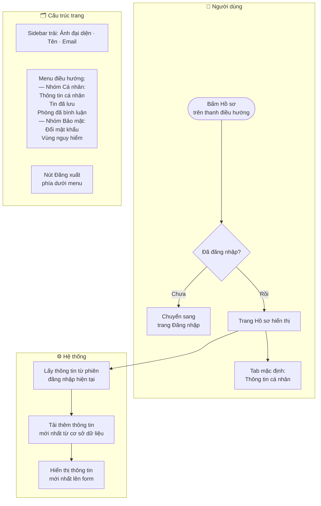
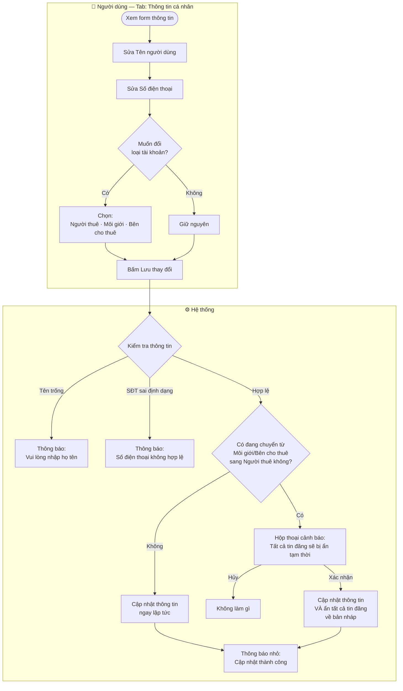
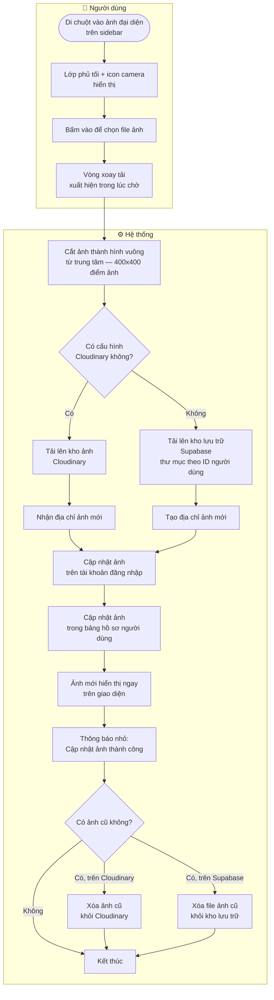
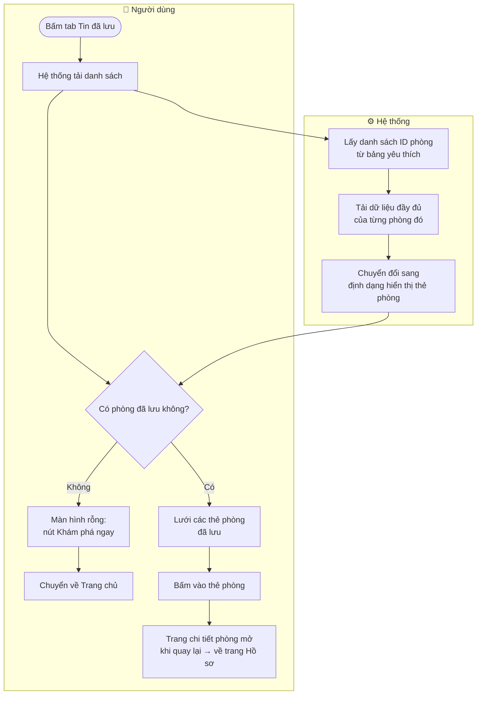
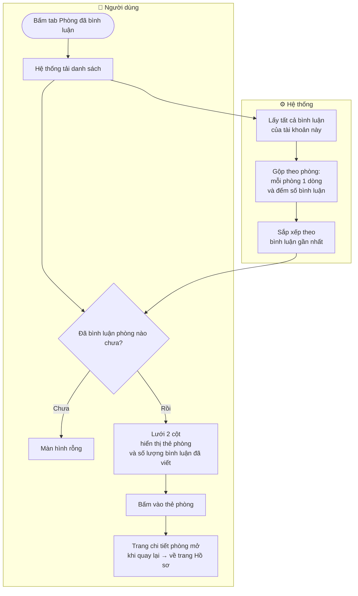
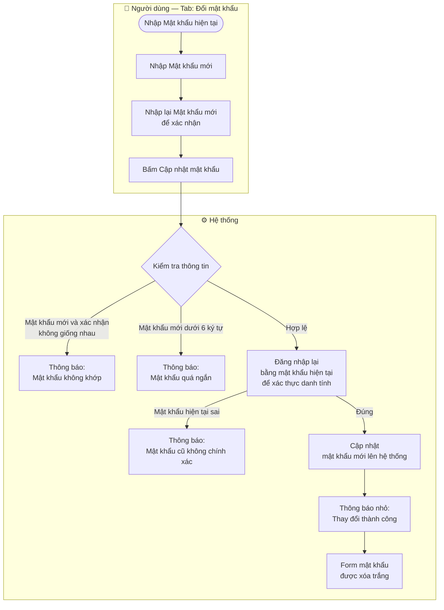
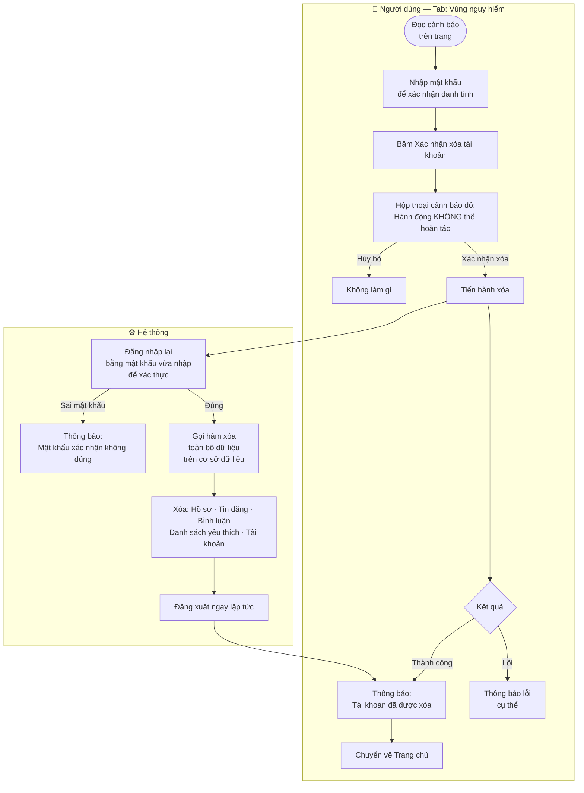
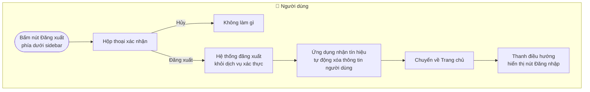

# 👤 Hồ sơ cá nhân — Cài đặt tài khoản

Tài liệu mô tả các tính năng trên trang Hồ sơ cá nhân của TroTot: chỉnh sửa thông tin, đổi ảnh đại diện, xem phòng đã lưu, đổi mật khẩu và xóa tài khoản.

> **Yêu cầu:** Phải đăng nhập. Truy cập qua đường dẫn `/profile`.

---

## 1. Vào trang Hồ sơ và khởi tạo dữ liệu

---

## 2. Cập nhật thông tin cá nhân

---

## 3. Thay ảnh đại diện

> **Lý do cắt vuông:** Ảnh đại diện luôn hiển thị trong khung tròn — cắt chính giữa giúp ảnh không bị méo.

---

## 4. Xem tin phòng đã lưu yêu thích

---

## 5. Xem phòng đã từng bình luận

---

## 6. Đổi mật khẩu

---

## 7. Xóa tài khoản vĩnh viễn

---

## 8. Đăng xuất

