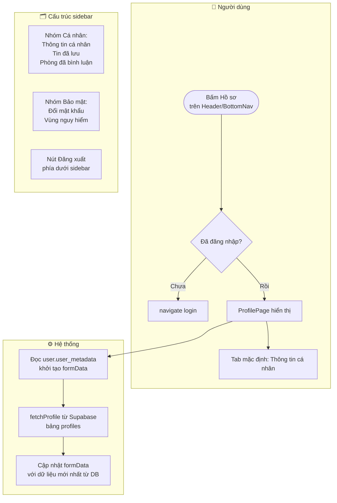
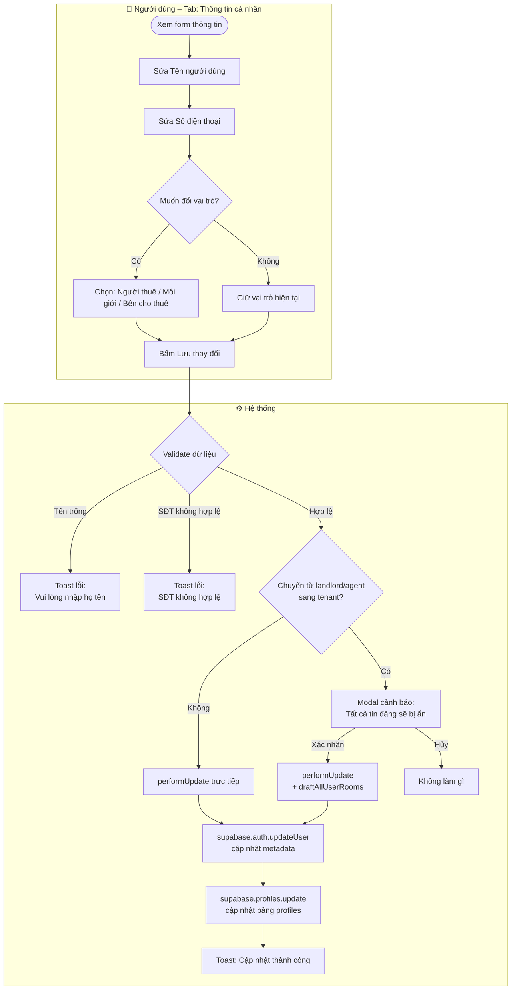
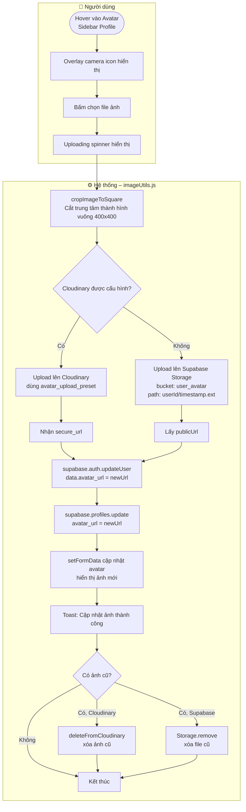
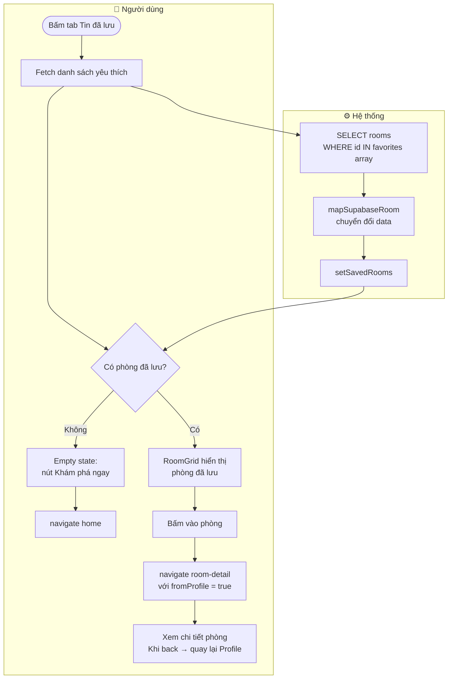
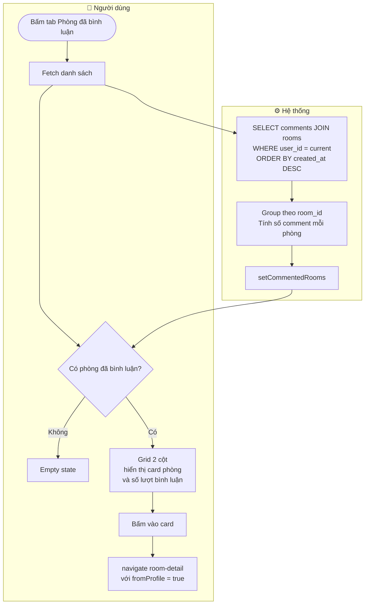
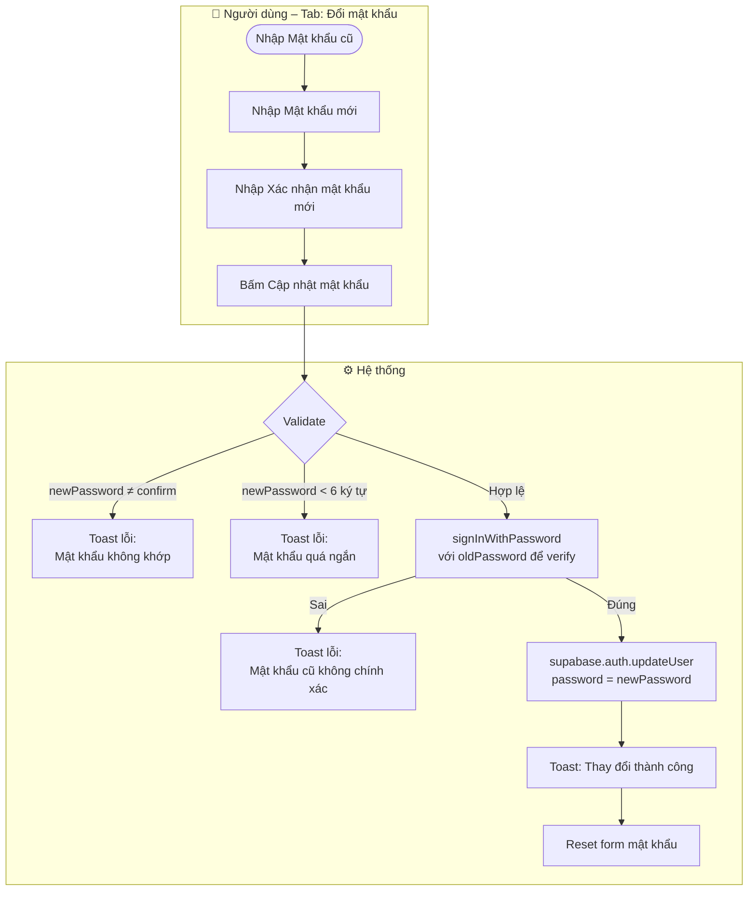
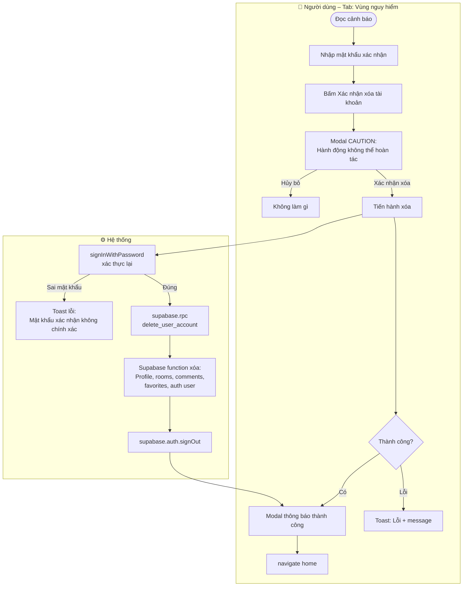
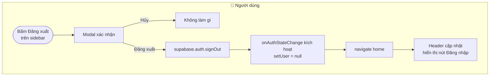

# 👤 Workflow: Hồ sơ người dùng (Profile)

Tài liệu mô tả luồng **quản lý thông tin cá nhân**, **đổi mật khẩu**, **tin đã lưu**, **phòng đã bình luận** và **xóa tài khoản**.

> **Yêu cầu:** Phải đăng nhập. Truy cập qua `/profile`.

---

## 1. Luồng truy cập và khởi tạo Profile

---

## 2. Luồng Cập nhật thông tin cá nhân

---

## 3. Luồng Upload ảnh đại diện (Avatar)

---

## 4. Luồng Tin đã lưu (Favorites)

---

## 5. Luồng Phòng đã bình luận

---

## 6. Luồng Đổi mật khẩu

---

## 7. Luồng Xóa tài khoản vĩnh viễn

---

## 8. Luồng Đăng xuất

